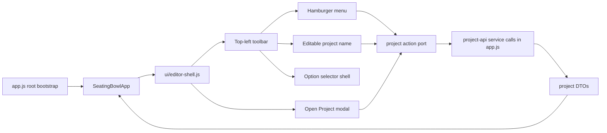

# Dashboard Cutover Phase 2 Configurator Toolbar And Project Menu Plan

## Status

- Status: Planned
- Planned on: 2026-03-16
- Depends on: Phase 1 direct-entry bootstrap
- Primary goal: move project-management entry points into the configurator shell without recreating dashboard knowledge in `ui/app.js`

## Purpose

Phase 2 delivers the visible shell cutover.

It replaces the current project chrome in the configurator with the top-left toolbar, moves project-related DOM ownership into `ui/editor-shell.js`, and brings `New`, `Open`, `Duplicate`, `Delete`, `Export`, rename, save, and sign-out flows into the configurator experience.

This phase does not finish multi-option persistence yet. The right-side option control lands as a real shell seam with the active option label and dropdown structure, but destructive and creation actions stay for Phase 3.

## Phase Diagram



## Scope Lock

In scope:

- [pages/configurator/index.html](/c:/Users/Elliott%20Klinger/Desktop/Repository/pages/configurator/index.html)
- [pages/configurator/styles.css](/c:/Users/Elliott%20Klinger/Desktop/Repository/pages/configurator/styles.css)
- [ui/editor-shell.js](/c:/Users/Elliott%20Klinger/Desktop/Repository/ui/editor-shell.js)
- [ui/app.js](/c:/Users/Elliott%20Klinger/Desktop/Repository/ui/app.js)
- [app.js](/c:/Users/Elliott%20Klinger/Desktop/Repository/app.js)
- existing project-related tests, plus focused shell tests as needed

Out of scope:

- full option create/duplicate/delete/rename behavior
- changing the persistence DTO shape
- creating new runtime files

## Architecture Verdict

The smallest compliant move is:

- move configurator project-menu DOM ownership into [ui/editor-shell.js](/c:/Users/Elliott%20Klinger/Desktop/Repository/ui/editor-shell.js)
- keep project-service orchestration in [app.js](/c:/Users/Elliott%20Klinger/Desktop/Repository/app.js)
- let [ui/app.js](/c:/Users/Elliott%20Klinger/Desktop/Repository/ui/app.js) pass one narrow project action port through to the shell
- keep pure project naming and save-request shaping in [state/project.js](/c:/Users/Elliott%20Klinger/Desktop/Repository/state/project.js)

Modules considered:

- [ui/app.js](/c:/Users/Elliott%20Klinger/Desktop/Repository/ui/app.js): rejected for toolbar DOM ownership because it must stay a composition and update shell
- [app.js](/c:/Users/Elliott%20Klinger/Desktop/Repository/app.js): rejected for direct DOM querying because root bootstrap should not own feature shell markup
- [ui/editor-shell.js](/c:/Users/Elliott%20Klinger/Desktop/Repository/ui/editor-shell.js): chosen because it already owns tabs, theme, export menu, shell buttons, and related DOM behavior

## Current Responsibility Slice

Current code that must move or be replaced:

- [app.js](/c:/Users/Elliott%20Klinger/Desktop/Repository/app.js) uses `wireProjectShellControls(...)` with direct DOM lookups for:
  - save
  - sign out
  - project name input
  - back-to-dashboard
- [pages/configurator/index.html](/c:/Users/Elliott%20Klinger/Desktop/Repository/pages/configurator/index.html) still contains the old center name field and left-rail dashboard button
- [ui/editor-shell.js](/c:/Users/Elliott%20Klinger/Desktop/Repository/ui/editor-shell.js) renders project chrome but does not own project menus or the project library modal

## Target Files And Exact Responsibilities

### [pages/configurator/index.html](/c:/Users/Elliott%20Klinger/Desktop/Repository/pages/configurator/index.html)

- replace the current center project-name strip with the new three-part toolbar layout
- remove the back-to-dashboard control from the left rail
- add markup hooks for:
  - hamburger menu trigger and menu panel
  - hover-editable project name field with pencil icon affordance
  - option selector trigger
  - open-project modal shell with search input and row action menu

### [pages/configurator/styles.css](/c:/Users/Elliott%20Klinger/Desktop/Repository/pages/configurator/styles.css)

- style the toolbar to match the supplied direction: compact control group, top-left of the center panel
- add hover state for the project-name edit pencil
- style the hamburger dropdown and open-project modal
- keep the current responsive grid and theme support intact

### [ui/editor-shell.js](/c:/Users/Elliott%20Klinger/Desktop/Repository/ui/editor-shell.js)

- own toolbar DOM querying and event binding
- render project name, active option label, and open-project modal state
- own the open/close behavior for the hamburger menu and project picker modal
- expose a single explicit project action interface, not a new callback bundle of unrelated lambdas
- continue to own save/theme/sign-out button behavior

### [ui/app.js](/c:/Users/Elliott%20Klinger/Desktop/Repository/ui/app.js)

- accept one structured `projectActions` or `projectMenuPort` input in the constructor
- pass that port into [ui/editor-shell.js](/c:/Users/Elliott%20Klinger/Desktop/Repository/ui/editor-shell.js)
- keep project-shell refresh, AppState access, and update orchestration only
- do not add any toolbar-specific DOM logic

### [app.js](/c:/Users/Elliott%20Klinger/Desktop/Repository/app.js)

- delete `wireProjectShellControls(...)`
- replace it with one explicit project action port that the configurator app can call
- own the service-backed implementations for:
  - save current project
  - sign out
  - create new project
  - list projects for the modal
  - open a selected project
  - duplicate a project
  - delete a project
  - rename the current project with immediate save

## Project Action Port

Use one explicit provider interface passed from [app.js](/c:/Users/Elliott%20Klinger/Desktop/Repository/app.js) into [ui/app.js](/c:/Users/Elliott%20Klinger/Desktop/Repository/ui/app.js), then down to [ui/editor-shell.js](/c:/Users/Elliott%20Klinger/Desktop/Repository/ui/editor-shell.js):

```text
projectActions = {
  saveCurrentProject(): Promise<void>
  renameCurrentProject(name: string): Promise<void>
  createProject(): Promise<void>
  listProjects(): Promise<ProjectSummary[]>
  openProject(projectId: string): Promise<void>
  duplicateProject(projectId: string): Promise<void>
  deleteProject(projectId: string): Promise<void>
  signOut(): Promise<void>
}
```

Builder rules for this port:

- pass it as one named interface object
- do not also pass `getProjectId()`, `getSession()`, or other private-state getters alongside it
- keep all returned values plain DTOs

## Option Control Rule For Phase 2

The right section is a shell seam only in this phase.

- show the active option trigger with the current label `Option 1`
- opening the dropdown shows the active item only
- do not expose `+ Option` or `Manage` actions yet
- keep the DOM hooks and render method names stable so Phase 3 can extend them instead of replacing them

## Implementation Sequence

1. Update [ui/app.js](/c:/Users/Elliott%20Klinger/Desktop/Repository/ui/app.js) to accept and forward one structured project action port.
2. Replace the root DOM wiring in [app.js](/c:/Users/Elliott%20Klinger/Desktop/Repository/app.js) with service-backed project action methods.
3. Add the toolbar and modal markup to [pages/configurator/index.html](/c:/Users/Elliott%20Klinger/Desktop/Repository/pages/configurator/index.html).
4. Add matching styling to [pages/configurator/styles.css](/c:/Users/Elliott%20Klinger/Desktop/Repository/pages/configurator/styles.css).
5. Expand [ui/editor-shell.js](/c:/Users/Elliott%20Klinger/Desktop/Repository/ui/editor-shell.js) to bind:
   - hamburger open/close
   - project name hover/edit state
   - save/sign-out using the port
   - open-project modal open/close, search, open, duplicate, delete
6. Remove the obsolete back-to-dashboard shell affordance.
7. Keep the option control render seam narrow and phase-limited to the active item only.

## DTO And Boundary Notes

- Project list rows used by the open-project modal must stay plain project summary DTOs from the service.
- Rename autosave must call the existing save edge with a plain `{ name, state }` request built outside `services/`.
- `services/project-api.js` must not receive AppState instances or controller-owned objects.
- `ui/editor-shell.js` may own search filtering UI state, but not canonical project or AppState data.

## Compliance Risks

- Do not re-create dashboard behavior in a new `ui/` coordinator file.
- Do not move modal list shaping into [ui/app.js](/c:/Users/Elliott%20Klinger/Desktop/Repository/ui/app.js).
- Do not let [app.js](/c:/Users/Elliott%20Klinger/Desktop/Repository/app.js) continue querying menu DOM after [ui/editor-shell.js](/c:/Users/Elliott%20Klinger/Desktop/Repository/ui/editor-shell.js) becomes the owner.
- Keep event handlers single-purpose; avoid one lambda that mutates state and also coordinates modal, save, and sign-out behavior together.

## Verification Gate

Required checks:

- `npm test`
- `npm run lint`
- `npm run typecheck`
- `npm run build`

Required focused assertions:

- project rename shows the hover pencil affordance and persists the trimmed name
- hamburger `New`, `Open`, `Duplicate`, `Delete`, `Export`, and sign-out actions are reachable from the configurator shell
- open-project modal search filters results, open works, and row overflow duplicate/delete work
- the old back-to-dashboard control is gone from the live configurator experience
- [app.js](/c:/Users/Elliott%20Klinger/Desktop/Repository/app.js) no longer owns project-menu DOM queries

## Definition Of Done

Phase 2 is complete when all of the following are true:

- the configurator contains the new toolbar shell
- project-management entry points no longer require a separate dashboard page
- project menu and project picker modal DOM behavior live in [ui/editor-shell.js](/c:/Users/Elliott%20Klinger/Desktop/Repository/ui/editor-shell.js)
- [app.js](/c:/Users/Elliott%20Klinger/Desktop/Repository/app.js) supplies one structured project action port instead of direct DOM listeners
- [ui/app.js](/c:/Users/Elliott%20Klinger/Desktop/Repository/ui/app.js) did not gain new feature-specific DOM ownership or DTO shaping
