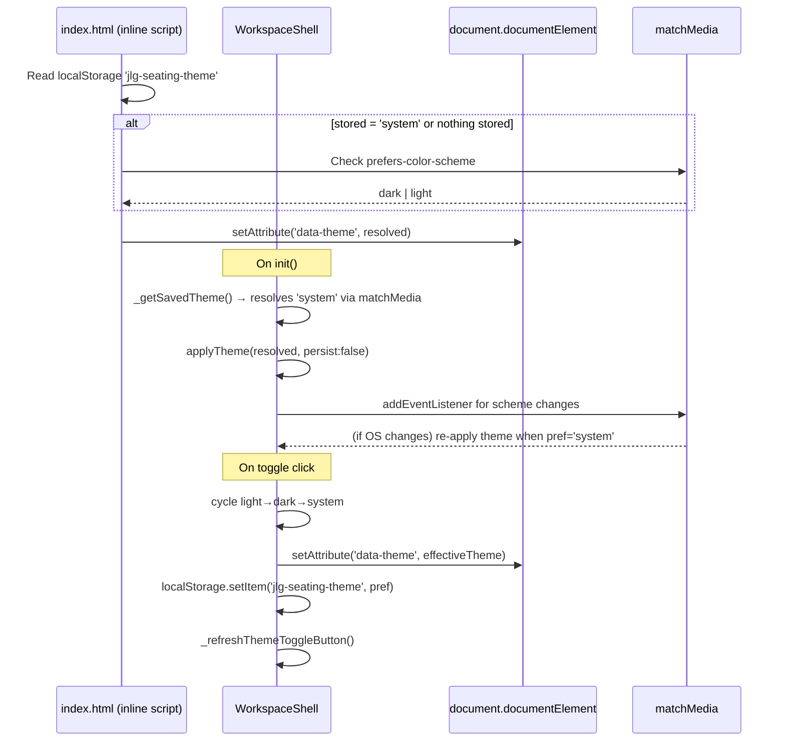

I have created the following plan after thorough exploration and analysis of the codebase. Follow the below plan verbatim. Trust the files and references. Do not re-verify what's written in the plan. Explore only when absolutely necessary. First implement all the proposed file changes and then I'll review all the changes together at the end.

## Observations

The dark theme is implemented via `[data-theme="dark"]` on `<html>`, toggled by `WorkspaceShell.applyTheme()` and persisted to `localStorage` under key `'jlg-seating-theme'`. The existing dark CSS block in `file:pages/configurator/styles.css` (lines 3219–3671) covers most panels, but several areas use **hardcoded hex values** in light-mode rules that are never overridden in dark mode. The theme toggle is a binary light/dark toggle — there is no "system preference" (`prefers-color-scheme`) option yet. The inline `<script>` in `file:pages/configurator/index.html` only reads `localStorage`, not the OS preference.

## Approach

All CSS gaps are filled by adding missing `html[data-theme="dark"]` overrides in `file:pages/configurator/styles.css`. The system-preference feature is handled in two places: the inline `<script>` in `file:pages/configurator/index.html` (boot-time resolution) and `WorkspaceShell._getSavedTheme()` in `file:ui/workspace-shell.js` (runtime resolution). A third stored value `'system'` is introduced. The theme toggle button cycles through three states. No new files are created; all changes stay within their correct existing owners.

---

## Implementation Steps

### Step 1 — Extend the stored theme values to support `'system'`

In `file:ui/workspace-shell.js`, update `_getSavedTheme()`:

- Accept `'system'` as a valid stored value alongside `'dark'` and `'light'`.
- When the stored value is `'system'`, resolve the effective theme by reading `window.matchMedia('(prefers-color-scheme: dark)').matches` and returning `'dark'` or `'light'` accordingly.
- Keep the fallback to `'light'` when nothing is stored.

Update `applyTheme(theme, ...)`:

- Accept `'system'` as a valid `theme` argument.
- When `theme === 'system'`, resolve the effective theme via `matchMedia` before applying `data-theme` to `document.documentElement`.
- Store `'system'` (not the resolved value) in `localStorage` so the preference is remembered.
- Add a `matchMedia` listener for `prefers-color-scheme` changes: when the stored preference is `'system'`, re-apply the resolved theme automatically without persisting again.
- Register the `matchMedia` listener cleanup in `this._cleanup`.

Update `_refreshThemeToggleButton()`:

- Reflect three states: `light`, `dark`, `system`.
- Update `aria-label` and `title` to cycle: light → dark → system → light.

Update `_bindThemeToggle()`:

- Cycle through `'light'` → `'dark'` → `'system'` → `'light'` on each click instead of toggling between two values.

---

### Step 2 — Update the boot-time theme detection script in `index.html`

In `file:pages/configurator/index.html`, update the inline `<script>` (lines 21–35):

- After reading `localStorage`, if the stored value is `'system'`, resolve the effective theme using `window.matchMedia('(prefers-color-scheme: dark)').matches`.
- If nothing is stored, also check `matchMedia` as the default (i.e., default to system preference on first visit rather than always defaulting to `'light'`).
- Apply the resolved effective theme to `document.documentElement.setAttribute('data-theme', ...)` as before.

---

### Step 3 — Fix hardcoded light-mode colors missing dark overrides in `styles.css`

In `file:pages/configurator/styles.css`, add `html[data-theme="dark"]` overrides for the following elements that currently use hardcoded hex values with no dark counterpart:

| Element / Selector | Light hardcode | Dark override needed |
|---|---|---|
| `.jlg-shell .sidebar` | `background: #ffffff` | `var(--bg-panel)` |
| `.jlg-shell .sidebar-header` | `background: #ffffff`, `border-bottom: 1px solid #e4e4e7` | `var(--bg-panel)`, `var(--border-color)` |
| `.jlg-shell .left-sidebar .sidebar-header` | `background: #ffffff` | `var(--bg-panel)` |
| `.jlg-shell .left-sidebar .sidebar-header::after` (green accent bar) | `background: #7aae1a` | `background: #8fcf33` |
| `.jlg-shell .sidebar-header h1` | `color: #18181b` | `var(--text-primary)` |
| `.jlg-shell .sidebar-header .subtitle` | `color: #71717a` | `var(--text-muted)` |
| `.jlg-shell .employee-strip` | `border-bottom: 1px solid #e4e4e7`, `background: linear-gradient(#ffffff, #ffffff)` | already covered — verify completeness |
| `.jlg-shell .sidebar-utility-panel` | `border-top: 1px solid #e4e4e7`, `background: #ffffff` | `var(--border-color)`, `var(--bg-panel)` |
| `.jlg-shell .sidebar-save-btn`, `.sidebar-signout-btn` | `border: 1px solid #d6d6d2`, `background: #ffffff`, `color: #232323` | already covered — verify hover states |
| `.jlg-shell .results-tabs-content` | `background: #ffffff` | `var(--bg-panel)` |
| `.jlg-shell .results-tab-btn.active` | `background: #ffffff` | `var(--bg-panel)` |
| `.jlg-shell .results-tab-btn:hover` | `background: #eceee5` | `var(--bg-hover)` |
| `.jlg-shell .right-sidebar .sidebar-header` | `background: linear-gradient(rgba(35,35,35,0.99), rgba(27,27,27,0.99))` | already dark — verify `border-bottom-color` |
| `.jlg-shell .brand-logo` | `border: 1px solid #d6d6d2` | `var(--border-color)` |
| `html, body` base rule | `background: #ffffff`, `color: #121417` | already covered by `html[data-theme="dark"] body.jlg-shell` — add `html[data-theme="dark"] html, html[data-theme="dark"] body` fallback |
| `.jlg-shell .left-sidebar` | `border-right-color: #d6d6d2` | `var(--border-color)` |
| `.jlg-shell .right-sidebar` | `border-left-color: #d6d6d2` | `var(--border-color)` |
| `.jlg-shell .icon-btn` | `color: #71717a` | `var(--text-muted)` |
| `.jlg-shell .icon-btn:hover` | `color: #101316` | `var(--text-primary)` |
| `.row-table-cell--warning` | `color: #ef4444` | keep as-is (semantic red, acceptable in dark) |

Add all missing overrides as a contiguous block appended to the existing **Dark Theme** section (after line 3671) to keep the file map accurate.

---

### Step 4 — Fix hardcoded colors in `styles-shared.css`

In `file:pages/styles-shared.css`, the `.dashboard-primary-btn` and `.dashboard-secondary-btn` rules use hardcoded `#0f1113`, `#ffffff`, `#111827`. Add a `html[data-theme="dark"]` block at the bottom of this file:

- `.dashboard-secondary-btn` / `.editor-route-btn-secondary`: set `background` to `var(--bg-input)`, `color` to `var(--text-primary)`, `border-color` to `var(--border-color)`.
- `.dashboard-primary-btn` / `.editor-route-btn-primary`: the dark background (`#0f1113`) is already appropriate for dark mode — no change needed.

---

### Step 5 — Update the theme toggle button UI to show three states

In `file:pages/configurator/index.html`, update the `#themeToggleBtn` markup (lines 508–527):

- Add a third SVG icon for the "system" state (e.g., a monitor/computer icon or a half-moon/half-sun icon), with class `theme-icon-system`, hidden by default.
- Update the `<span class="theme-toggle-label">` to reflect the current cycle label.

In `file:pages/configurator/styles.css`, add rules to show/hide the three icons based on the current theme state. Use a `data-theme-pref` attribute on the button (set by JS) to drive icon visibility:

```
[data-theme-pref="light"]  → show moon icon (next action: go dark)
[data-theme-pref="dark"]   → show sun icon (next action: go system)
[data-theme-pref="system"] → show system icon (next action: go light)
```

Add the corresponding `html[data-theme="dark"]` overrides for the new icon visibility rules.

---

### Step 6 — Wire the `data-theme-pref` attribute in `WorkspaceShell`

In `file:ui/workspace-shell.js`, update `_refreshThemeToggleButton()`:

- Set `themeToggleBtn.dataset.themePref` to the stored preference (`'light'`, `'dark'`, or `'system'`) — not the resolved effective theme.
- Update `aria-label` and `title` to describe the **next** action in the cycle.

---

## Flow Summary

