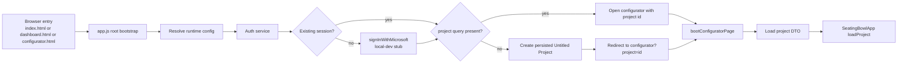

# Dashboard Cutover Phase 1 Direct Entry and Auth Scaffold Plan

## Status

- Status: Planned
- Planned on: 2026-03-16
- Depends on: current dashboard/configurator split only
- Primary goal: make the configurator the default post-auth landing path in development without moving project or option logic into `ui/app.js`

## Purpose

Phase 1 establishes the cutover seam.

It removes the dashboard from the runtime boot path, scaffolds a development-only Microsoft SSO entry point, and guarantees that an authenticated user who has no `project` query is sent into a real persisted `Untitled Project` in the configurator.

This phase does not add the new in-configurator menus yet. It only makes direct entry and bootstrap behavior stable enough for the later UI and options phases.

## Phase Diagram

## Scope Lock

In scope:

- [app.js](/c:/Users/Elliott%20Klinger/Desktop/Repository/app.js)
- [index.html](/c:/Users/Elliott%20Klinger/Desktop/Repository/index.html)
- [pages/dashboard/dashboard.html](/c:/Users/Elliott%20Klinger/Desktop/Repository/pages/dashboard/dashboard.html)
- [services/auth-service.js](/c:/Users/Elliott%20Klinger/Desktop/Repository/services/auth-service.js)
- [state/project.js](/c:/Users/Elliott%20Klinger/Desktop/Repository/state/project.js)
- focused tests covering bootstrap and auth boundary behavior

Out of scope:

- toolbar and modal UI work
- option persistence or option management
- deleting legacy dashboard runtime files
- moving any feature-specific DOM ownership into `ui/app.js`

## Architecture Verdict

The smallest compliant move is:

- keep [app.js](/c:/Users/Elliott%20Klinger/Desktop/Repository/app.js) as the only route-aware bootstrap
- add the Microsoft SSO scaffold to [services/auth-service.js](/c:/Users/Elliott%20Klinger/Desktop/Repository/services/auth-service.js), not to a UI file
- keep untitled-project DTO shaping in [state/project.js](/c:/Users/Elliott%20Klinger/Desktop/Repository/state/project.js)
- leave [ui/app.js](/c:/Users/Elliott%20Klinger/Desktop/Repository/ui/app.js) unchanged except for existing public load methods

Modules considered:

- [ui/app.js](/c:/Users/Elliott%20Klinger/Desktop/Repository/ui/app.js): rejected for auth bootstrap and project creation because it is not route-aware and must remain a thin configurator orchestrator
- [ui/editor-shell.js](/c:/Users/Elliott%20Klinger/Desktop/Repository/ui/editor-shell.js): rejected because Phase 1 has no new shell UI
- [state/project.js](/c:/Users/Elliott%20Klinger/Desktop/Repository/state/project.js): chosen for untitled-project request shaping because it already owns pure project DTO helpers

## Current Responsibility Slice

Current runtime behavior that blocks the cutover:

- [app.js](/c:/Users/Elliott%20Klinger/Desktop/Repository/app.js) still imports `DashboardPage` and branches between dashboard and configurator flows
- `bootConfiguratorPage()` rejects missing `project` ids and redirects users back to the dashboard
- local development auth requires manual sign-in input instead of a Microsoft SSO seam
- the dashboard is the only place that can create a new persisted project before opening the editor

## Target Files And Exact Responsibilities

### [app.js](/c:/Users/Elliott%20Klinger/Desktop/Repository/app.js)

- remove the `DashboardPage` import and all dashboard-controller boot logic
- keep only route detection, service creation, session bootstrap, project creation/open redirect, and configurator boot
- if the current page is `dashboard`, redirect to the configurator route while preserving query and hash
- if no active session exists in local-dev mode, call `authService.signInWithMicrosoft()`
- if no `project` query exists after auth, create a new project and redirect to `?project=<id>`

### [services/auth-service.js](/c:/Users/Elliott%20Klinger/Desktop/Repository/services/auth-service.js)

- add `signInWithMicrosoft()` to the public auth-service contract
- local-dev mode: seed and persist the existing plain session DTO without any UI form
- API mode: return a clear `Microsoft SSO is not implemented in this build.` error rather than inventing a backend contract
- keep `getSession()` and `signOut()` unchanged

### [state/project.js](/c:/Users/Elliott%20Klinger/Desktop/Repository/state/project.js)

- add a dedicated helper for the new untitled-project bootstrap request
- normalize the default bootstrap project name to `Untitled Project`
- keep the returned payload as `{ name, state }` using the current default AppState JSON

### [index.html](/c:/Users/Elliott%20Klinger/Desktop/Repository/index.html)

- remove the dashboard-first redirect logic
- redirect all normal entry traffic to the configurator route, preserving search params and hash

### [pages/dashboard/dashboard.html](/c:/Users/Elliott%20Klinger/Desktop/Repository/pages/dashboard/dashboard.html)

- keep the file only as a compatibility route shell
- replace dashboard-specific copy with redirect/cutover copy if needed
- do not boot the old dashboard UI from this route anymore

## Imports To Change

[app.js](/c:/Users/Elliott%20Klinger/Desktop/Repository/app.js)

- delete the import from `./pages/dashboard/dashboard.js`
- extend the import from `./state/project.js` with the untitled-project create helper

[services/auth-service.js](/c:/Users/Elliott%20Klinger/Desktop/Repository/services/auth-service.js)

- no new imports from `ui/` or `state/`

[state/project.js](/c:/Users/Elliott%20Klinger/Desktop/Repository/state/project.js)

- keep current `state/app-state.js` import only
- no imports from `ui/`, `services/`, or `viz/`

## DTO And Boundary Notes

- The auth service must still return plain session DTOs only.
- The project bootstrap request must still be a plain `{ name, state }` object.
- No AppState instance, controller, or callback bundle may cross the service boundary.
- `app.js` may orchestrate project creation and redirect flow, but it must not normalize project payloads inline.

## Implementation Sequence

1. Add the untitled-project bootstrap helper to [state/project.js](/c:/Users/Elliott%20Klinger/Desktop/Repository/state/project.js).
2. Extend [services/auth-service.js](/c:/Users/Elliott%20Klinger/Desktop/Repository/services/auth-service.js) with `signInWithMicrosoft()` using the existing local-dev session DTO.
3. Refactor [app.js](/c:/Users/Elliott%20Klinger/Desktop/Repository/app.js) so all entry paths go through configurator boot.
4. Update configurator boot to:
   - ensure a session exists
   - create a new untitled project if `project` is absent
   - redirect to the resulting configurator URL
5. Update [index.html](/c:/Users/Elliott%20Klinger/Desktop/Repository/index.html) and [pages/dashboard/dashboard.html](/c:/Users/Elliott%20Klinger/Desktop/Repository/pages/dashboard/dashboard.html) to behave as compatibility redirects, not dashboard launchers.
6. Leave [pages/dashboard/dashboard.js](/c:/Users/Elliott%20Klinger/Desktop/Repository/pages/dashboard/dashboard.js) and [ui/project-dashboard.js](/c:/Users/Elliott%20Klinger/Desktop/Repository/ui/project-dashboard.js) in place but unreferenced until Phase 3 cleanup.

## Compliance Risks

- Do not add feature DOM querying to [app.js](/c:/Users/Elliott%20Klinger/Desktop/Repository/app.js) while replacing the dashboard flow.
- Do not push sign-in or redirect logic into [ui/app.js](/c:/Users/Elliott%20Klinger/Desktop/Repository/ui/app.js).
- Keep the untitled-project request builder pure in [state/project.js](/c:/Users/Elliott%20Klinger/Desktop/Repository/state/project.js).
- Keep API-mode auth failure explicit instead of silently falling back to local browser storage.

## Verification Gate

Required checks:

- `npm test`
- `npm run lint`
- `npm run typecheck`
- `npm run build`

Required focused assertions:

- entry through `/` lands in the configurator route
- entry through `/pages/dashboard/dashboard.html` redirects into the configurator route
- local-dev boot with no session calls `signInWithMicrosoft()` and does not require the old dashboard form
- local-dev boot with no `project` query creates exactly one `Untitled Project` and redirects to it
- boot with an existing `project` query still loads the project into the configurator

## Definition Of Done

Phase 1 is complete when all of the following are true:

- the dashboard is no longer part of the live runtime boot path
- local development boot can establish a stub Microsoft-authenticated session without the dashboard UI
- missing-project entry creates and opens a real persisted `Untitled Project`
- no new imports from `services/` to `state/` were introduced
- [ui/app.js](/c:/Users/Elliott%20Klinger/Desktop/Repository/ui/app.js) did not gain auth, routing, or DTO-shaping responsibilities
